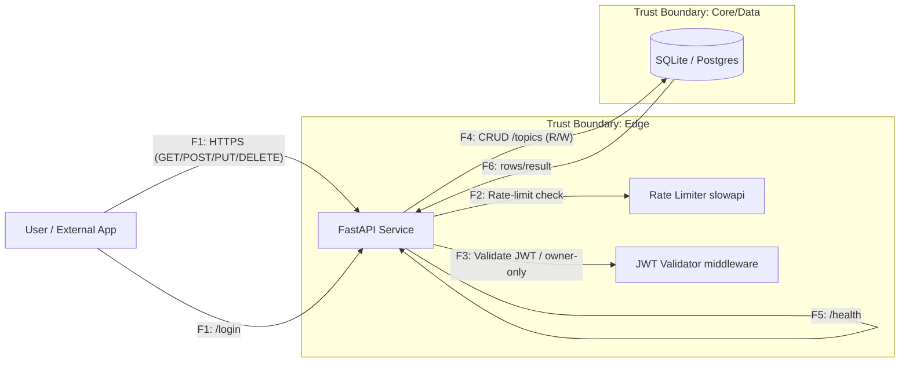
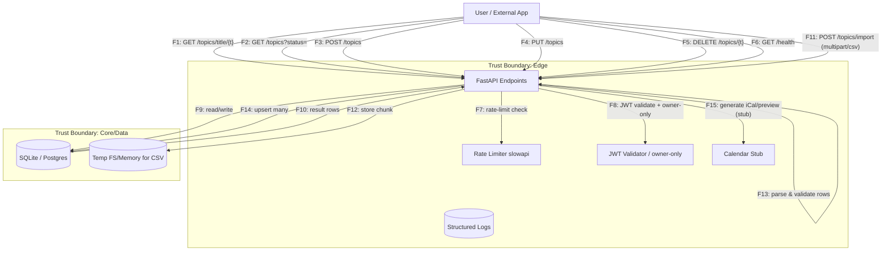

# DFD (Mermaid) — Study Planner

## Контекст

```mermaid
flowchart LR
    user[User / External App]

    subgraph EDGE[Trust Boundary: Edge]
        svc[FastAPI Service]
        rl[Rate Limiter slowapi]
        auth[JWT Validator middleware]
    end

    subgraph CORE[Trust Boundary: Core/Data]
        db[(SQLite / Postgres)]
    end

    user -- "F1: HTTPS (GET/POST/PUT/DELETE)" --> svc
    user -- "F1: /login" --> svc
    svc  -- "F2: Rate-limit check" --> rl
    svc  -- "F3: Validate JWT / owner-only" --> auth
    svc  -- "F4: CRUD /topics (R/W)" --> db
    svc  -- "F5: /health" --> svc
    db   -- "F6: rows/result" --> svc
```
## Логика

```mermaid
flowchart TB
    user[User / External App]

    subgraph EDGE[Trust Boundary: Edge]
      direction LR
      svc[FastAPI Endpoints]
      rl[Rate Limiter slowapi]
      auth[JWT Validator / owner-only]
      log[(Structured Logs)]
      cal[Calendar Stub]
    end

    subgraph CORE[Trust Boundary: Core/Data]
      db[(SQLite / Postgres)]
      tmp[(Temp FS/Memory for CSV)]
    end

    %% Основные публичные эндпоинты
    user -- "F1: GET /topics/title/{t}" --> svc
    user -- "F2: GET /topics?status=" --> svc
    user -- "F3: POST /topics" --> svc
    user -- "F4: PUT /topics" --> svc
    user -- "F5: DELETE /topics/{t}" --> svc
    user -- "F6: GET /health" --> svc

    %% Внутренние проверки/сервисные потоки
    svc -- "F7: rate-limit check" --> rl
    svc -- "F8: JWT validate + owner-only" --> auth

    %% Доступ к данным
    svc -- "F9: read/write" --> db
    db  -- "F10: result rows" --> svc

    %% Stretch: CSV import
    user -- "F11: POST /topics/import (multipart/csv)" --> svc
    svc  -- "F12: store chunk" --> tmp
    svc  -- "F13: parse & validate rows" --> svc
    svc  -- "F14: upsert many" --> db

    %% Stretch: Calendar stub (без внешних вызовов)
    svc -- "F15: generate iCal/preview (stub)" --> cal
```
